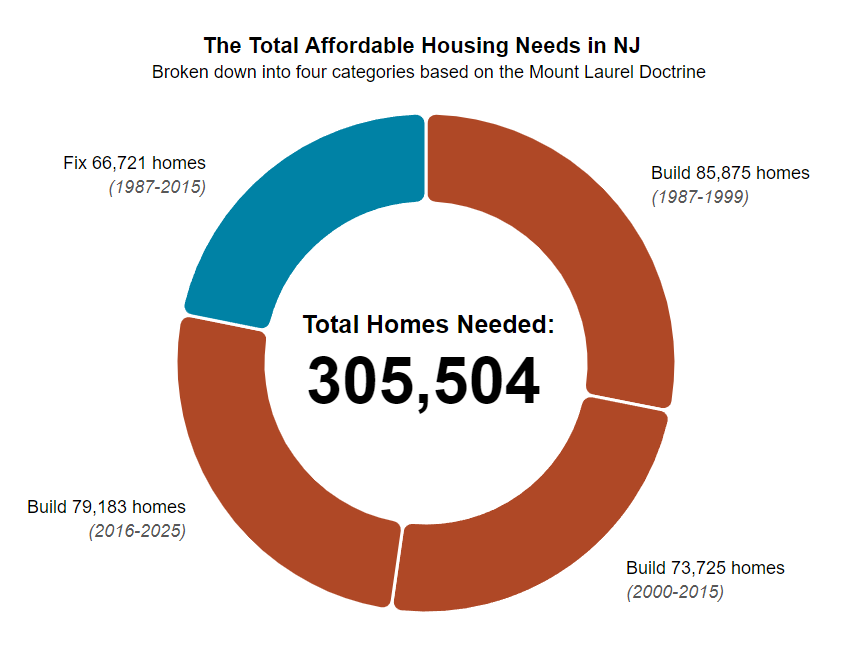

Final Project
===============
The final project was a force network using d3 and applying a neat science fiction dataset. 

You can check out the [final viz here!](https://savanaben.github.io/dataViz/). 

This repo will no longer be maintained and any updates to the final viz will occur at my [main repo](https://github.com/savanaben/folio). 


Week 9 Homework
===============
For week 9 I built on the interactive network file from our previous class to display a network of [barn swallows](https://networkrepository.com/aves-barn-swallow-non-physical.php). 

This project became more about learning d3 networks vs having a completed final viz, but I'm still happy with what I learned along the way. 
  - I learned how to convert a .edges network file to the dual csv files (nodes + links) d3 uses. This involved some open-refine aspects, like learning how you can split data into multiple columns based on the spacing (so that I could break up the .edges file into seperate columns, as raw all the data showed in 1 column). 
  - How to add labels to nodes by grouping the node + text into a svg group. 
  - General expansion of knowledge on how to weight links, and how the various force parameters work. 

Here is a gif of how it displays:


Week 8 Homework
===============
For week 8 I created a donut chart that coveys the total affordable housing needed in NJ. While donut charts are a bit divisive, I thought this usage was more appropriate given the wedges are a part of a whole, and the mainline takeaway is the total listed in the center. I believe the wedges act as a nice secondary exploration of the data, and communicate both the general consistency of the Mount Laurel Doctrine (each year range requires about the same amount of new homes be built), and the dual breakup between new homes needing to be built vs. existing homes needing to be fixed.  

Here is an image of how it displays:




Week 5 Homework
===============
For this week's homework I focused on making week 4's graph as accessible as possible by applying the following techniques. 
- Visual Display
  - The page background color was set to an off-white to lessen photophobia issues. 
  - The orange and purple line colors were carefully selected to meet [WCAG 1.4.11 Non-text Contrast](https://www.w3.org/TR/WCAG21/#non-text-contrast) rules. While [WCAG 1.4.1 Use of Color](https://www.w3.org/TR/WCAG21/#use-of-color) specifies that "Color is not used as the only visual means of communicating information," I believe these lines meet the WCAG through the use of contrast, achieving at least a 3:1 contrast ratio to eachother and the page background.
  - All font sizes are within reasonable (browser default or larger) limits. 
  - All other text and element colors meet the required 3:1 or 4.5:1 contrast ratios. 
  - The y-axis labels are also acting as legends with the vertical line symbol, which acts as the non-color-based link to the associated data line. 
- Screen Reader Support
  - The main focus for this week was learning how to support extensive screen reader "alt" text. My work often has me thinking about alt text for complex images, such as charts. Further, in the specific world of assessment, you can't always alt text in an intuitive way. For example, when describing a chart normally with alt text, you might summarize or skim over the details (such as the x and y axis start and end increments) for brevity, focusing on the high-level interpretation instead. But, if the goal is to leave the interpretive aspect to the user (as in an assessment where we can't give away the answer), the chart needs to be described in more literal terms. When doing this, the alt text can get extremely long. 
  <br>
  <br>
  My goal was to come up with a way to make very long alt text better for screen readers by creating a hierarchy. Instead of depending on "alt," I created a screen-reader only invisible div following [webAIM](https://webaim.org/techniques/css/invisiblecontent/) best practices, which enables me to use simple html markup to organize content with p and list tags. Doing this enables a screen reader to jump from one list element to the next to quicky skim over the long description. Each list element starts with a brief summary of what it's describing, so you can  listen briefly to see if this is the element you want to listen to fully or not. Note that for this practice activity, I might not have gotten as strictly literal in the screen-reader description as would be required for an assessment (especially in describing the data lines).
  <br>
  <br>
  the "aria-hidden="true"" tag was added to the div where the chart is created by d3, so screen readers skip over it. 
  <br>
  <br>
  This was tested using ChromeVox to confirm that everything reads as expected. Following is the invisible html read to the screen reader. For what the chart looks like, see Week 4. 

```HTML
  <figure>
    <div role="img" aria-hidden="true" id="dataviz"></div>
    <div class="SRonly">
        <p>Shown is a chart with the title "Property Values and Taxes in Lambertville NJ."</p>
        <ul>
            <li>Description of chart axes. This dual axis chart includes a standard x-axis running along the bottom, and 2 y-axes running along the left and right sides. </li>
            <li>left y-axis. The left y-axis is labeled "Average Residential Property Value (in dollars)." The axis starts at $200,000 and moves up in increments of $20,000, reaching a maximum of $380,000.</li>
            <li>Right y-axis. The right y-axis is labeled "Average Yearly Property Taxes (in dollars)." The axis starts at $4,000 and moves up in increments of $500, reaching a maximum of $8,000.</li>
            <li>bottom x-axis. The x-axis is labeled "Years," and starts at 2006 on the left, moving to 2020 on the right.</li>
            <li>chart data and interpretation. The chart shows two lines which track average yearly property value and average yearly property taxes in Lambertville, NJ. The two lines start fairly far apart, but then steadily converge between 2010 to 2020. While property taxes increased at a steady linear rate across the charts time period, property values decreased from 2009 to 2014, before slowly increasing again. Overall the graph shows that property values and property taxes have not maintained the same ratio over time. </li>
        </ul>
        <p>End of chart description.</p>
    </div>
  </figure>
```

Week 4 Homework
===============
For week 4 I created a dual axis line graph comparing property taxes and values in Lambertville, NJ. The data was compiled from [nj.gov](https://www.nj.gov/dca/divisions/dlgs/resources/property_tax.html). SVG lines were used in the main viz (d3.line) and two small lines in the y-axis labels to enable them to act as psudo legends too. This [dual axis code sample](https://blocks.lsecities.net/d3noob/9bb90996fd0e67ba62ce871443b526fd) was really helpful in figuring this out. 

Here is an image of how it displays:


Week 3 Homework
===============
The file NJ_affordableHousingByCounty.html shows the affordable housing obligations of each county in NJ under the Mount Laurel Doctrines latest 2017 Judge Jacobson ruling. I used csv data from previous project research which broke down the housing numbers by municipality and county. The [D3.js Graph Gallery](https://www.d3-graph-gallery.com/index.html) was really helpful here. 

Here is an image of how it displays:


Week 2 Homework
===============

D3 Foundations Chart
---------------------

THe attached viz creates a scatterplot using the provided dataset. 

Here is an image of how it displays:


